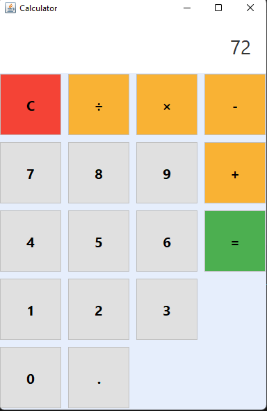

# Simple Calculator

**Project ID:** #CC5255  
**Project Title:** Simple Calculator  
**Internship Domain:** Java Development Intern  
**Project Level:** Entry Level  
**Assigned By:** CodeClause Internship  
**Assigned To:** Roni Seikh

## 📌 Description

This is a **Java Swing-based Simple Calculator** application designed as part of the CodeClause Java Development Internship. It provides a user-friendly graphical interface for performing basic arithmetic operations: addition, subtraction, multiplication, and division.

The calculator evaluates live expressions, handles errors like division by zero, and ensures a clean, intuitive layout using the Swing framework.

## 🛠️ Technologies Used

- Java SE
- Swing (Java GUI Library)
- AWT (Abstract Window Toolkit)

## 🎯 Features

- Modern calculator UI using Java Swing
- Supports operations: `+`, `-`, `×`, `÷`
- Real-time input and result display
- Handles invalid expressions gracefully
- Button color-coding for better UX
- Displays formatted results

## 💻 How to Run

1. Ensure Java JDK (version 8 or above) is installed.
2. Open terminal or command prompt in the project folder.
3. Compile the program:
4. Run the program:

The calculator GUI will launch and is ready for use.

## 🧠 Concepts Applied

- GUI Programming with Java Swing
- Event-driven architecture
- Stack-based expression evaluation
- Operator precedence management
- Exception handling and input validation

## 📸 Screenshots

### 🖼️ Calculator Interface

### 🧮 Sample Input and Output

## 🙌 Acknowledgments

Thanks to **CodeClause** for this opportunity to gain hands-on Java development experience through practical project implementation.

## 👨‍💻 Developed By

**Roni Seikh**  
Java Development Intern  
CodeClause Internship

- 🔗 [LinkedIn](https://www.linkedin.com/in/roniseikh)
- 🐙 [GitHub](https://github.com/Roni-Seikh)

---

> Designed & developed with ❤️ by Roni Seikh
